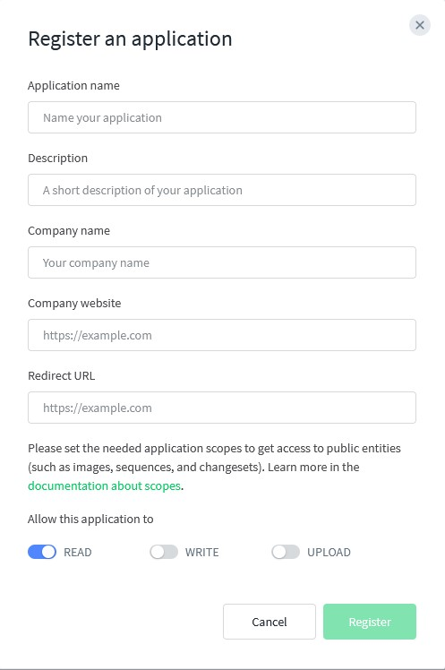
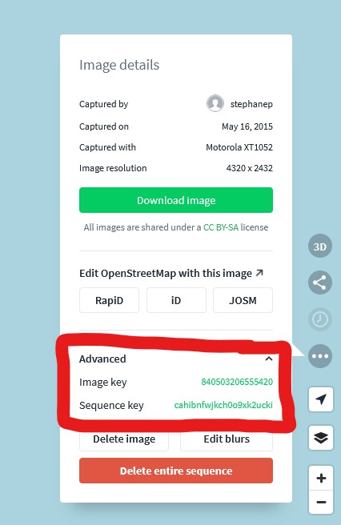

# mapillary_download
Simple code to download images in one or several mapillary sequences. The images will be geotagged and oriented.

## How to use
### Setup env variables
copy the secret variables files to setup your maipllary dev token, and your panoramax OpenStreetMap token.
```Shell
cp secrets_variables_examples.sh secrets_variables.sh
editor secrets_variables.sh
```

### Get ALL the sequences of SEVERAL users
To avoid to download everything at once, this is a 2 steps process:
- 1/ We set a list of users for which we want to get the list of sequences to download, and get a bash script for each user.
   Change the list of users in the batch file `batch_get_username.sh`. 
   change the access token with your access token and the sequence ids with the ids of the sequences you want to download
   ```bash
   usernames=( "someone_having_nice_pictures" "someone_else" "oh_look_a_these_usernames" ) # use real accounts, it might work better
   ```
   This will give you a few files that the other scripts will use to generate a script to download all sequences of each user. One user, one bash script generated.


- 2/ We can launch the download of all the sequences of a user for every user specified in the batch script.
   ```bash
   bash script_bash_get_sequences_for_user_SOMEONE.sh
   ```
   **Or all of the generated batch scripts at once.**
   
   ```bash
   bash script_bash_get_sequences_for_user_*
   ```

Don't worry if you rerun the same user `script_bash_get_sequences_for_user_someone.sh` twice, the pictures will not be downloaded twice. Every run of mapillary_download.py checks that pictures are not existing before willing to download them.

### Get only one sequence with its ID
To find a sequence id you can use the batch script, or click on a sequence on the Mapillary website, click on a picture, click on advanced data, and copy the sequence ID.

```Shell
python mapillary_download.py "MLY|xxxx|xxxxxxx" --sequence_ids xxxxxxxxxxx xxxxxxxxxxx
```

### Available arguments
```Shell
python mapillary_download.py -h
usage: mapillary_download.py [-h] [--sequence_ids [SEQUENCE_IDS ...]] [--image_ids [IMAGE_IDS ...]] [--destination DESTINATION]
                   [--image_limit IMAGE_LIMIT] [--overwrite]
                   access_token

positional arguments:
  access_token          Your mapillary access token

optional arguments:
  -h, --help            show this help message and exit
  --sequence_ids [SEQUENCE_IDS ...]
                        The mapillary sequence id(s) to download
  --image_ids [IMAGE_IDS ...]
                        The mapillary image id(s) to get their sequence id(s)
  --destination DESTINATION
                        Path destination for the images
  --image_limit IMAGE_LIMIT
                        How many images you want to download
  --overwrite           overwrite existing images
  -v, --version         show program's version number and exit
```
## Sort pictures depending of a bounding box in their Exif GPS Data in a separate folder

This is used to restrict zones for national instances of Panoramax to upload to reuse the sequences of multi national users.

Edit the bounding boxes in `find_france_photos_and_move.py` and change the destination folder.
Running the script will check in the /data folder for every user sequences and move the files being in the bouding boxes in the `destionation` folder path of the script.

For this script to read the exif of pictures, you will need the python package `exifread`
It was tested with pictures taken with the App Open Camera.


## How to get my Mapillary access token
 - Go to https://www.mapillary.com/dashboard/developers
 - Click on "Registrer Application", enter the needed informations, enable the application to "Read" data, then click on register :

    
 - When this registration is done, click on "view" in the token column. This is you access token : 

    

## How to get my sequence id (or sequence key)

 - Go to https://mapillary.com/app
 - Click on one of the picture of the sequence you want to download
 - Click on the "image option" button (right panel)
 - Click on "advanced" then click on the sequence key to copy it in the clipboard

    

## How to install the script with a virtual environnement

```Shell
cd ~
git clone https://github.com/Stefal/mapillary_download.git
cd mapillary_download
python3 -m venv mly_venv
source mly_venv/bin/activate
python -m pip install -r requirements.txt
```
Then you can run `python mapillary_download  "MLY|xxxx|xxxxxxx" --sequence_ids xxxxxxxxxxx`
When you're done with the script, simply run `deactivate` to exit the virtual environnement.

On windows you can create a virtual environnement too, or use the prebuilt `mapillary_download.exe` available on the release page.


## How to batch the upload to panoramax

After having downloaded the sequences of a user you will find them in the folder `data`.
go in your `data` folder, and to the user subfolder, and assuming you have already sent pictures with geovisio_cli, you can run this command to send all the sequences of the current folder you're in:


```Shell
cd data/some_user

for dir in */; do   dir=${dir%?}  ;   geovisio upload --api-url https://panoramax.openstreetmap.fr "$dir" --token=BLAH_BLAH ; done
```
Have fun!
